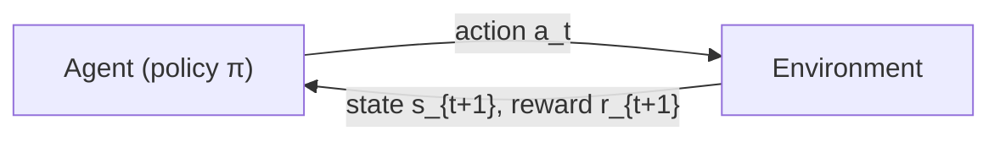
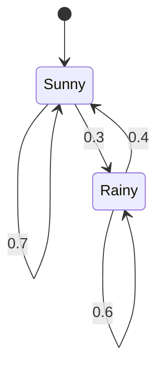

# Basic Introduction to Reinforcement Learning

> A quick review note for two weeks of study: from the very first concepts to
> the classic algorithms. It is written for a complete beginner, so every idea
> is introduced with a plain-language explanation, a formula, and (where
> useful) a small example. The companion code lives in `cartpole/`.

---

## 1. Basic Concepts

### 1.1 The agent–environment loop

Reinforcement learning (RL) is the study of how an **agent** should act in an
**environment** in order to maximise a numerical **reward**. The interaction is
step-by-step:



At every step $t$:

1. the agent observes the current **state** $s_t$;
2. it picks an **action** $a_t$;
3. the environment returns the next state $s_{t+1}$ and a **reward** $r_{t+1}$;
4. repeat.

The agent does **not** get told *which* action was good; it only sees rewards
that may arrive many steps later. This is called the **credit assignment
problem**: if you finally win a game, which of the last 100 moves deserve the
credit?

### 1.2 A running example: FrozenLake

We will use the classic **FrozenLake** environment as a mental model.

```text
S  F  F  F
F  H  F  H
F  F  F  H
H  F  F  G
```

- The agent (you) stands on a frozen lake, starting at **S** (top-left).
- **F** cells are safe frozen tiles. **H** cells are holes: falling in ends the
  episode with reward 0. **G** is the goal: reaching it gives reward +1.
- The ice is *slippery*: when you choose a direction, you sometimes slide to a
  random neighbouring cell instead. This makes the world **stochastic**.
- Each move is one **step**; the sequence from S until you fall in a hole or
  reach G is one **episode**.

### 1.3 Core vocabulary

| Term | Meaning | In FrozenLake |
| --- | --- | --- |
| **Environment** | Everything outside the agent that it cannot change directly | The frozen lake, holes, ice physics |
| **Agent** | The learner/decision maker | You |
| **Step** | One interaction (observe, act, receive reward) | One move |
| **State** $s$ | The information the agent sees | Which cell you are in |
| **Action** $a$ | A choice the agent makes | Up / Down / Left / Right |
| **Reward** $r$ | A scalar signal received after an action | 0 normally, +1 at G |
| **Return** $G_t$ | The *discounted total* reward from time $t$ onwards | Total score of the rest of the episode |
| **Trajectory** $\tau$ | The whole sequence of states, actions, rewards | `S, Up, F, Up, H(0)` etc. |
| **Episode** | One complete trajectory (finite tasks) | One run from S to G or a hole |
| **Policy** $\pi$ | The agent's strategy: what action to take in each state | Your rule for choosing directions |

### 1.4 The return

Rewards may arrive at different times. The **return** accumulates them, with a
**discount factor** $\gamma \in [0, 1)$:

$$
G_t = R_{t+1} + \gamma R_{t+2} + \gamma^2 R_{t+3} + \cdots
    = \sum_{k=0}^{\infty} \gamma^k R_{t+k+1}
$$

**Example.** Suppose a trajectory of FrozenLake gives rewards
$0, 0, 0, 1$ with $\gamma = 0.9$. Then

$$
G_0 = 0 + 0.9 \cdot 0 + 0.9^2 \cdot 0 + 0.9^3 \cdot 1 = 0.729.
$$

### 1.5 Why discount at all?

- A reward now is more certain and more useful than the same reward later
  (money today beats money next year).
- For infinite-horizon tasks, an undiscounted sum of rewards usually diverges
  to infinity, so there is nothing to maximise. Discounting keeps the return
  finite (each term is bounded by $\gamma^k R_{\max}$).
- It is a convenient single knob: $\gamma$ close to 1 makes the agent
  far-sighted; $\gamma$ close to 0 makes it greedy.

### 1.6 On-policy vs off-policy

- **On-policy** methods learn about the *same* policy that generates the data.
  If the policy changes, old experience is no longer valid. Examples:
  REINFORCE, actor–critic, PPO. Our CartPole scripts are on-policy.
- **Off-policy** methods can learn about a target policy from data collected by
  a *different* behaviour policy. This allows **experience replay** (reusing
  old transitions many times). Examples: Q-learning, DQN.

**Why it matters.** On-policy methods are simpler and their theory is cleaner,
but they discard data as soon as the policy updates. Off-policy methods reuse
data, but need corrections such as **importance sampling** (Section 7) to keep
estimates unbiased.

---

## 2. Mathematical Background

RL is mostly *probability* and *expectation*. This section collects exactly
the tools you need.

### 2.1 Conditional probability

For two events $A$ and $B$ (with $P(B) > 0$):

$$
P(A \mid B) = \frac{P(A \cap B)}{P(B)}.
$$

**Example.** In FrozenLake, let $B$ = "the agent is on a safe cell" and
$A$ = "the next action reaches the goal". Then $P(A \mid B)$ is the chance of
reaching G *given* that the agent is currently safe.

### 2.2 Expectation

The expectation is a **weighted average** of a random variable:

$$
\mathbb{E}[X] = \sum_x x \, P(X = x) \quad \text{(discrete)},
\qquad
\mathbb{E}[X] = \int_{-\infty}^{\infty} x \, f(x) \, dx \quad \text{(continuous)}.
$$

**Example.** A fair die: $\mathbb{E}[X] = \frac{1}{6}(1+2+\cdots+6) = 3.5$.
Notice that the expectation itself (3.5) is not a value the die can show.

Two properties are used constantly:

- **Linearity**: $\mathbb{E}[aX + bY] = a\,\mathbb{E}[X] + b\,\mathbb{E}[Y]$
  (holds even when $X, Y$ are dependent — this is why returns decompose so
  nicely).
- **Expectation of a function**: if $Y = g(X)$, then
  $\mathbb{E}[Y] = \sum_x g(x) P(X = x)$.

### 2.3 Joint and conditional densities

For two continuous random variables $X, Y$ with joint density $f(x, y)$:

- the **marginal** density of $X$ is $f_X(x) = \int f(x, y)\, dy$;
- the **conditional** density of $Y$ given $X = x$ is

$$
f_{Y \mid X}(y \mid x) = \frac{f(x, y)}{f_X(x)}.
$$

This is just the continuous version of the conditional-probability formula.

### 2.4 Conditional expectation

$$
\mathbb{E}[X \mid Y = y] = \sum_x x \, P(X = x \mid Y = y).
$$

**Key subtlety.** $\mathbb{E}[X \mid Y]$ is itself a *random variable*: it is a
function of $Y$. Only once we plug in a concrete value $Y = y$ do we get a
number.

**Example.** In FrozenLake, the expected number of steps to reach G depends on
the current cell. "Expected steps from cell (2,2)" is a conditional
expectation. As the agent moves, this number changes — that is exactly what the
value function $V(s)$ captures (Section 4.2).

### 2.5 The tower property (law of iterated expectations)

$$
\mathbb{E}\big[\mathbb{E}[X \mid Y]\big] = \mathbb{E}[X].
$$

**Intuition.** If you want the average salary over all people, you can first
compute the average salary *within each profession*, then average those
averages over professions. Both give the same overall average.

**Why RL uses it.** The Bellman equation (Section 5) is exactly the tower
property applied one step ahead: the expected return from $s$ equals the
expected immediate reward plus the expected future value.

### 2.6 Why all this matters

Every quantity RL optimises — $V^\pi(s)$, $Q^\pi(s,a)$, the policy-gradient
objective — is a conditional expectation. If you understand "average over the
future, given the current state", you already understand the heart of RL.

---

## 3. Notation

| Symbol | Meaning |
| --- | --- |
| $\mathcal{S}$ | state space (all possible states) |
| $\mathcal{A}$ | action space (all possible actions) |
| $s_t, a_t, r_t$ | state, action, reward at time step $t$ |
| $\pi(a \mid s)$ | stochastic policy: probability of taking $a$ in $s$ |
| $\mu(s)$ | deterministic policy: the chosen action in $s$ |
| $\gamma$ | discount factor |
| $G_t$ | discounted return from time $t$ |
| $P(s' \mid s, a)$ | transition probability to $s'$ given $(s, a)$ |
| $R(s, a, s')$ | reward function |
| $V^\pi(s)$ | state-value function under $\pi$ |
| $Q^\pi(s, a)$ | action-value function under $\pi$ |
| $\tau$ | a trajectory (s, a, r, s, a, r, ...) |
| $\rho_t$ | importance-sampling ratio at time $t$ |
| $\theta$ | parameters of the policy network |
| $\delta_t$ | TD error at time $t$ |
| $A_t$ | advantage at time $t$ |

---

## 4. Markov Chains and Markov Decision Processes

### 4.1 Markov chain

A **Markov chain** is a sequence of states with the **Markov property**: the
future depends on the past **only through the present**.

$$
P(s_{t+1} \mid s_t, s_{t-1}, \ldots, s_0) = P(s_{t+1} \mid s_t).
$$

- **State space** $\mathcal{S}$: the set of possible states.
- **Transition operator** $\mathcal{P}$: describes the probability of moving
  from one state to another, e.g. a matrix $P_{ij} = P(s_{t+1} = j \mid s_t = i)$.
  Every row sums to 1: $\sum_j P_{ij} = 1$.
- The chain is a **stochastic dynamic system**: the next state is random, but
  its distribution is completely determined by the current state.

**Example: weather.** Let $\mathcal{S} = \{\text{Sunny}, \text{Rainy}\}$ with

$$
P = \begin{pmatrix} 0.7 & 0.3 \\ 0.4 & 0.6 \end{pmatrix}.
$$



If today is sunny, tomorrow is sunny with probability 0.7 and rainy with 0.3.
The future does not care about the weather from two days ago.

### 4.2 Markov Decision Process (MDP)

An MDP is a Markov chain **plus actions, rewards, and a goal**. It is the
formal backbone of RL and is defined by the tuple

$$
(\mathcal{S}, \mathcal{A}, P, R, \gamma).
$$

- **State space** $\mathcal{S}$: everything the agent can observe.
- **Action space** $\mathcal{A}$: everything the agent can do.
- **Transition kernel** $P(s' \mid s, a)$: probability of landing in $s'$ after
  taking $a$ in $s$. In FrozenLake, choosing "Up" from (0,0) might still slide
  you into (1,0) because the ice is slippery.
- **Reward function** $R(s, a, s')$ (or simply the reward $r$ observed): a
  scalar telling the agent how good that transition was.
- **Discount factor** $\gamma$: how much the agent cares about the future.
- **Policy** $\pi(a \mid s)$: the agent's behaviour. It may be *deterministic*
  ($a = \mu(s)$) or *stochastic* ($a \sim \pi(\cdot \mid s)$). Stochastic
  policies are important because they explore and can represent ties.

**Trajectory and its probability.** A trajectory is

$$
\tau = (s_0, a_0, r_1, s_1, a_1, r_2, s_2, \ldots).
$$

Its probability under policy $\pi$ is the product of all the pieces:

$$
P_\pi(\tau) = P(s_0) \prod_{t \ge 0} \pi(a_t \mid s_t)\, P(s_{t+1} \mid s_t, a_t).
$$

**Return function.** The return is
$G_t = \sum_{k=0}^{\infty} \gamma^k R_{t+k+1}$ as in Section 1.4.

**State-value function.** The expected return starting from state $s$ and then
following $\pi$:

$$
V^\pi(s) = \mathbb{E}_\pi\!\left[ G_t \mid S_t = s \right].
$$

**Action-value function.** The expected return starting from state $s$, taking
action $a$, then following $\pi$:

$$
Q^\pi(s, a) = \mathbb{E}_\pi\!\left[ G_t \mid S_t = s, A_t = a \right].
$$

The two are related by averaging over the first action:

$$
V^\pi(s) = \sum_{a \in \mathcal{A}} \pi(a \mid s)\, Q^\pi(s, a).
$$

**Optimal value functions.** The best possible value from a state is

$$
V^*(s) = \max_{\pi} V^\pi(s),
\qquad
Q^*(s, a) = \max_{\pi} Q^\pi(s, a).
$$

A policy achieving these is an **optimal policy** $\pi^*$. For any MDP, at
least one optimal deterministic policy exists — the challenge is finding it.

---

## 5. Bellman Equations

### 5.1 Derivation (the one-step decomposition)

The trick is to split the return into the **immediate reward** and the
**discounted future**:

$$
\begin{aligned}
G_t &= R_{t+1} + \gamma R_{t+2} + \gamma^2 R_{t+3} + \cdots \\
    &= R_{t+1} + \gamma \underbrace{\left(R_{t+2} + \gamma R_{t+3} + \cdots\right)}_{= G_{t+1}} \\
    &= R_{t+1} + \gamma G_{t+1}.
\end{aligned}
$$

Taking the conditional expectation of both sides and applying the tower
property gives a recursive equation for the value function.

### 5.2 Bellman expectation equation for $V^\pi$

$$
V^\pi(s) =
\sum_{a} \pi(a \mid s)
\sum_{s', r} P(s', r \mid s, a)
\Big[ r + \gamma\, V^\pi(s') \Big].
$$

**Read it in words:** the value of $s$ = (average over what the policy might
do) × (average over what the environment might do) × (immediate reward + the
discounted value of wherever we land).

The corresponding equation for $Q^\pi$ is

$$
Q^\pi(s, a) =
\sum_{s', r} P(s', r \mid s, a)
\Big[ r + \gamma \sum_{a'} \pi(a' \mid s')\, Q^\pi(s', a') \Big].
$$

### 5.3 Bellman optimality equations

Replace "average over the policy" by "best action" (max):

$$
V^*(s) = \max_{a}
\sum_{s', r} P(s', r \mid s, a)
\Big[ r + \gamma\, V^*(s') \Big],
$$

$$
Q^*(s, a) =
\sum_{s', r} P(s', r \mid s, a)
\Big[ r + \gamma\, \max_{a'}\, Q^*(s', a') \Big].
$$

The second equation is the workhorse behind **Q-learning and DQN**: if you knew
$Q^*$, the optimal policy would be simply $\pi^*(s) = \arg\max_a Q^*(s, a)$.

### 5.4 Why we do not solve them directly

For a **fixed** policy, the Bellman equations form a system of $|\mathcal{S}|$
linear equations that could in principle be solved exactly:

$$
V^\pi = (I - \gamma P^\pi)^{-1} R^\pi.
$$

The problem is **scale**:

- inverting an $|\mathcal{S}| \times |\mathcal{S}|$ matrix costs roughly
  $O(|\mathcal{S}|^3)$ operations;
- FrozenLake has 16 states (fine), but Go has about
  $10^{170}$ states (impossible);
- the *optimality* equations contain $\max$, which makes them nonlinear.

This is why every practical RL method (dynamic programming, Monte Carlo, TD,
deep networks) is an **approximate, iterative** solution of these same
equations.

---

## 6. Monte Carlo Methods

### 6.1 The idea

We do not know $P(s' \mid s, a)$. So instead of computing the expectation
symbolically, we **let the agent interact with the environment**, collect many
trajectories, and use the observed returns as estimates:

$$
\hat{V}(s) = \frac{1}{N(s)} \sum_{i=1}^{N(s)} G_t^{(i)},
$$

where the sum runs over episodes that visited state $s$. (Averages over the
first visit to $s$ — *first-visit MC* — are standard; every-visit MC is the
obvious variant.)

**Example.** To estimate the value of cell (1,1) in FrozenLake, run 1000
episodes, collect the return whenever the agent was in (1,1) at some time, and
average.

### 6.2 The law of large numbers

The sample mean converges to the true expectation as the sample size grows:

$$
\frac{1}{N}\sum_{i=1}^N G^{(i)} \xrightarrow[N \to \infty]{} \mathbb{E}[G].
$$

This is the theoretical licence for Monte Carlo estimation: *use many samples
and trust the average*.

### 6.3 The central limit theorem (how precise is the estimate?)

The CLT tells us the *speed* of convergence and how to report uncertainty:

$$
\frac{\frac{1}{N}\sum_{i=1}^N G^{(i)} - \mathbb{E}[G]}
{\sigma / \sqrt{N}} \;\xrightarrow{d}\; \mathcal{N}(0, 1),
$$

so the error of the estimate shrinks like $\sigma / \sqrt{N}$.

**Example.** If returns have standard deviation $\sigma = 10$:

- $N = 100$ episodes $\Rightarrow$ error ≈ $10 / \sqrt{100} = 1.0$;
- $N = 10{,}000$ episodes $\Rightarrow$ error ≈ $10 / 100 = 0.1$.

To get one more digit of precision you need **100× more data**. This explains
why Monte Carlo methods feel data-hungry.

### 6.4 Pros and cons

| Pros | Cons |
| --- | --- |
| Unbiased: the estimate converges to the true value | High variance: needs many episodes |
| Simple, model-free: no transition probabilities needed | Must wait for an episode to finish before updating |
| Easy to understand | Cannot be used in continuing (non-episodic) tasks |

---

## 7. Importance Sampling

### 7.1 Motivation

Sometimes we only have data from a **behaviour policy** $b$, but we want to
estimate expectations under a **target policy** $\pi$. Example: a robot
recorded a day of driving with a cautious policy; we want to know how well a
brave policy would have done, without re-driving.

### 7.2 The formula

The probability of a trajectory under $\pi$ versus $b$ differs only by the
policy terms, so

$$
P_\pi(\tau) = P_b(\tau) \prod_{t} \frac{\pi(a_t \mid s_t)}{b(a_t \mid s_t)}.
$$

The per-step ratio

$$
\rho_t = \frac{\pi(a_t \mid s_t)}{b(a_t \mid s_t)}
$$

is the **importance-sampling ratio**, and

$$
\mathbb{E}_\pi[f] = \mathbb{E}_b\big[\rho_t \, f\big].
$$

**Example (biased coin).** You flip a coin with $P(H) = 0.9$ (behaviour $b$)
and record 1000 outcomes. To estimate what would happen under a fair coin
(target $\pi$, $P(H) = 0.5$), weight every "heads" by
$\frac{0.5}{0.9}$ and every "tails" by $\frac{0.5}{0.1}$.

### 7.3 Weighted importance sampling

The plain estimator can have huge variance. The **weighted** version divides
by the sum of the ratios and has lower variance (at the cost of slight bias):

$$
\hat{V}(s) = \frac{\sum_i \rho_i G^{(i)}}{\sum_i \rho_i}.
$$

### 7.4 Where it appears

- **Off-policy Monte Carlo** estimation and learning.
- **PPO** (Section 13): the objective itself is an importance-sampling ratio
  $\pi_\theta / \pi_{\theta_{\text{old}}}$, clipped to stay near 1.

---

## 8. Policy Gradient

### 8.1 The big idea

Value-based methods first estimate $Q(s,a)$ and then pick greedy actions.
Policy-gradient methods **skip the value function** and optimise the policy
parameters $\theta$ directly. The objective is the expected return from the
start state:

$$
J(\theta) = \mathbb{E}_{\tau \sim \pi_\theta}\big[ G_0 \big].
$$

We want to find $\theta$ that maximises $J(\theta)$, i.e. climb the hill of
$J$ using $\nabla_\theta J(\theta)$.

### 8.2 The log-derivative trick

The density of a trajectory factorises (Section 4.2), and the derivative of a
logarithm simplifies products into sums:

$$
\nabla_\theta \log P_\pi(\tau)
= \sum_t \nabla_\theta \log \pi_\theta(a_t \mid s_t).
$$

Because $\nabla P = P \cdot \nabla \log P$, we can write the gradient of the
objective as an expectation over trajectories — this is the **policy gradient
theorem**:

$$
\nabla_\theta J(\theta)
= \mathbb{E}_{\tau \sim \pi_\theta}\left[
  \sum_t \nabla_\theta \log \pi_\theta(a_t \mid s_t)\; G_t
\right].
$$

### 8.3 Intuition

If an action led to a large $G_t$, the term $\nabla \log \pi(a_t \mid s_t)$
points in the direction that **increases** the probability of that action, and
the gradient step moves the policy that way. Actions with small returns push
the probability down. In other words: *good actions become more likely, bad
actions become less likely*.

### 8.4 REINFORCE: the classic algorithm

REINFORCE is Monte Carlo policy gradient: collect a full episode, then update
once.

```text
Initialize policy parameters θ
Repeat for each episode:
    Generate a trajectory (s_0, a_0, r_1, s_1, ...) using π_θ
    For every time step t:
        G_t = sum of discounted rewards from t onwards
        θ ← θ + α ∇_θ log π_θ(a_t | s_t) * G_t
```

Equivalently, we minimise the loss

$$
\mathcal{L}(\theta) = -\sum_t \log \pi_\theta(a_t \mid s_t)\, G_t.
$$

### 8.5 Why it has high variance

Each episode is a single noisy sample of the return; the update uses $G_t$
directly. Variance can be reduced without introducing bias by subtracting a
**baseline** — this is exactly the topic of Section 11.

---

## 9. Value Estimation and Incremental Updates

### 9.1 What and why

Almost every RL algorithm needs an estimate of $V^\pi(s)$ or $Q^\pi(s,a)$ —
either as the final answer (value-based methods) or as a helper (baselines,
actor–critic critics). We estimate them from data because we do not know the
transition kernel.

### 9.2 Incremental implementation

Instead of storing all observed returns and recomputing the mean, update
on the fly:

$$
V(s) \leftarrow V(s) + \alpha \big[ G_t - V(s) \big],
$$

with $\alpha = \frac{1}{N}$ for a plain sample average. If we keep a fixed
small $\alpha$ instead, we get an **exponential moving average** that forgets
old data gradually.

### 9.3 Why do it incrementally

- **Memory**: we never store the full history of returns, so memory is
  $O(|\mathcal{S}|)$ instead of growing forever.
- **Online learning**: the estimate is available at every step, not only after
  all data is collected.
- **Non-stationarity**: in RL the value function changes as the policy
  changes; a moving average can track it, while a full average of ancient data
  cannot.

---

## 10. Temporal Difference (TD) Learning

> *Correction to the original draft note:* TD learning is **not** a way to
> calculate returns. It is a way to **estimate value functions** by combining
> a real reward with a **bootstrapped** guess of the future value. Only pure
> Monte Carlo computes full returns.

### 10.1 The key update (TD(0))

$$
V(s_t) \leftarrow V(s_t) + \alpha \big[
  \underbrace{r_{t+1} + \gamma V(s_{t+1})}_{\text{TD target}}
  - \underbrace{V(s_t)}_{\text{current estimate}}
\big].
$$

The difference inside the brackets is the **TD error**:

$$
\delta_t = r_{t+1} + \gamma V(s_{t+1}) - V(s_t).
$$

**Why "temporal difference"?** We compare the prediction made at time $t$
(that is $V(s_t)$) with the prediction available one step later
($r_{t+1} + \gamma V(s_{t+1})$). Their difference drives the update.

### 10.2 One-step, n-step, infinite-step

- **1-step TD (TD(0))** uses one real reward plus a bootstrap:
  $G_{t:t+1} = r_{t+1} + \gamma V(s_{t+1})$.
- **n-step TD** uses $n$ real rewards and then bootstraps:

$$
G_{t:t+n} = r_{t+1} + \gamma r_{t+2} + \cdots + \gamma^{n-1} r_{t+n}
           + \gamma^{n} V(s_{t+n}).
$$

- **Infinite-step TD = Monte Carlo**: $n \to \infty$ means no bootstrap at all;
  the target is the full return $G_t$.

So MC and TD are not different families of ideas; they are the two ends of one
spectrum. The update is always

$$
V(s_t) \leftarrow V(s_t) + \alpha \big[ \text{target} - V(s_t) \big].
$$

### 10.3 The $\lambda$-return

Why choose one $n$? We can blend *all* n-step targets geometrically:

$$
G_t^{\lambda} = (1 - \lambda) \sum_{n=1}^{\infty} \lambda^{\,n-1} G_{t:t+n},
$$

with $\lambda \in [0, 1]$.

- $\lambda = 0$: only the 1-step target $\Rightarrow$ TD(0).
- $\lambda = 1$: only the full return $\Rightarrow$ Monte Carlo.
- $0 < \lambda < 1$: a weighted mixture — more data, less variance.

This is the **bias–variance tradeoff** in one knob:

| Method | Bias | Variance | Update speed |
| --- | --- | --- | --- |
| TD(0) | Higher (starts from possibly wrong guesses) | Low | Every step |
| n-step / $\lambda$-return | Middle | Middle | After $n$ steps |
| Monte Carlo | Zero | High | Only at episode end |

**Example: estimating commute time.** You guess the trip home takes 30
minutes. After 5 minutes of driving you update your guess; after 10 minutes
you update again — that is TD: revise the estimate at every step. MC would sit
in the car, do nothing, and only at arrival replace the whole guess with the
actual total. TD is faster but can be led astray by a bad early guess; MC is
slower but never biased.

---

## 11. REINFORCE with Baseline

### 11.1 The problem with plain REINFORCE

In Section 8 the policy gradient is

$$
\nabla_\theta J(\theta) = \mathbb{E}\left[ \sum_t \nabla_\theta \log
\pi_\theta(a_t \mid s_t)\, G_t \right].
$$

$G_t$ varies wildly across episodes, so the gradient estimate is noisy.
**Key fact**: subtracting a baseline $b(s_t)$ that does **not** depend on the
action leaves the expectation unchanged, because

$$
\sum_a \pi(a \mid s)\, \nabla_\theta \log \pi_\theta(a \mid s) = 0.
$$

### 11.2 The update

Replace $G_t$ by the **advantage**

$$
A_t = G_t - b(s_t),
$$

and minimise

$$
\mathcal{L}(\theta) = -\sum_t \log \pi_\theta(a_t \mid s_t)\, A_t.
$$

The best choice of baseline is the value function $V^\pi(s_t)$: it is the
conditional expectation of $G_t$ given the state, so it removes as much
variance as possible without bias. In practice we learn it with a second
network (a critic), fitting $V(s_t)$ to the Monte Carlo return $G_t$.

**Example.** Two students study for the same exam. Raw score $G_t$ is noisy
(one had a bad day). What matters is the **advantage**: did you beat what was
expected of you, given your preparation? A baseline of "expected score for
your preparation" isolates the effect of your actions.

This is precisely what `cartpole_pytorch.py` does: a policy network plus a
value network trained with

$$
\mathcal{L}_{\text{policy}} = -\sum_t \log \pi(a_t \mid s_t)\,
\big(G_t - V(s_t)\big),
\qquad
\mathcal{L}_{\text{value}} = \text{Huber}\big(V(s_t), G_t\big).
$$

---

## 12. Actor–Critic

### 12.1 The structure

- **Actor**: the policy $\pi_\theta(a \mid s)$ — decides what to do.
- **Critic**: the value function $V_w(s)$ — judges how good the situation is.

The critic provides the baseline *online*. The classic **one-step actor–critic**
uses the TD error as the advantage:

$$
A_t = r_{t+1} + \gamma V_w(s_{t+1}) - V_w(s_t).
$$

The actor is updated by

$$
\theta \leftarrow \theta + \alpha_\theta\, \nabla_\theta
\log \pi_\theta(a_t \mid s_t)\, A_t,
$$

and the critic is updated by TD (Section 10):

$$
w \leftarrow w + \alpha_w\, \nabla_w \big[ A_t \big]^2
\quad \text{(i.e. fit } V_w(s_t) \text{ to } r_{t+1} + \gamma V_w(s_{t+1})).
$$

### 12.2 One-step vs multi-step advantage

One-step TD advantages have the lowest variance but the highest bias. They
also spread learning signal only one step at a time. **Multi-step advantages**
($n$-step returns or GAE) sit in the middle:

- they carry information about several future rewards, so credit is assigned
  faster;
- their bias is smaller than one-step TD, while their variance stays far below
  Monte Carlo.

**Generalized Advantage Estimation (GAE)** blends TD errors geometrically,
exactly like the $\lambda$-return:

$$
A_t^{\text{GAE}} = \sum_{l=0}^{\infty} (\gamma \lambda)^l\,
\delta_{t+l},
\qquad
\delta_t = r_{t+1} + \gamma V(s_{t+1}) - V(s_t).
$$

$\lambda = 0$ reduces to one-step TD; $\lambda = 1$ approaches Monte Carlo.
PPO uses GAE in practice.

### 12.3 A known pitfall (tie-in with our code)

On CartPole, **pure one-step TD actor–critic barely learns**. With constant
+1 rewards and $\gamma = 0.99$, the critic's bootstrap keeps $V(s)$ far below
its self-consistent value, so the TD error of almost every non-terminal step
is a near-constant positive number. A constant advantage has zero *expected*
policy gradient, leaving only sampling noise, and the policy collapses.
Multi-step/GAE advantages fix this by carrying the episode-end signal back to
earlier states. This is why `cartpole_actor_critic.py` includes a warning in
its docstring.

---

## 13. PPO (Proximal Policy Optimization)

### 13.1 Why "new policy and old policy must not be too far apart"

The policy gradient step

$$
\theta \leftarrow \theta + \alpha\, \nabla_\theta J(\theta)
$$

is only *locally* valid. A step that is too large can move the policy to a
bad region: the old data no longer represents the new policy, and the next
update is built on garbage. (Think of a hill-climber that takes such a long
stride that it leaps over the hilltop into a valley.) This is the problem of
**trust regions**: constrain the update so the new policy stays close to the
old one.

### 13.2 The importance-sampling ratio

Let $\pi_{\theta_{\text{old}}}$ be the policy that collected the data. The
ratio of action probabilities is

$$
r_t(\theta) = \frac{\pi_\theta(a_t \mid s_t)}{\pi_{\theta_{\text{old}}}(a_t \mid s_t)}.
$$

$r_t = 1$ means "same probability as before"; $r_t > 1$ means "the new policy
likes this action more". The plain surrogate objective is

$$
L(\theta) = \mathbb{E}\big[ r_t(\theta)\, A_t \big].
$$

### 13.3 The clipped objective

PPO stops the update from running away by clipping the ratio:

$$
L^{\text{CLIP}}(\theta) =
\mathbb{E}\left[
  \min\!\big(
    r_t(\theta)\, A_t,\;
    \operatorname{clip}(r_t(\theta),\, 1-\varepsilon,\, 1+\varepsilon)\, A_t
  \big)
\right],
$$

with a small $\varepsilon$ (e.g. 0.2).

**Intuition.**

- If $A_t > 0$ (good action), we want to increase its probability — but only
  up to the ratio $1 + \varepsilon$; beyond that the term is clipped and gives
  no extra gradient.
- If $A_t < 0$ (bad action), we want to decrease it — but no further than
  $1 - \varepsilon$.

So PPO takes the safe part of every gradient step, and the new policy can
never drift too far from the old one in a single round.

### 13.4 Pseudocode

```text
for iteration:
    collect trajectories with policy π_{θ_old}
    compute advantages A_t (e.g. with GAE)
    for several epochs:
        update θ to maximise L^CLIP(θ) using minibatches
    θ_old ← θ
```

### 13.5 Why PPO is practical

- Only first-order gradients are needed (unlike TRPO's constrained
  optimisation), so it is simple to implement and GPU-friendly.
- The clipping gives stability without a hard KL constraint.
- It is **on-policy**, but within one rollout the data can be reused for
  several epochs safely, because the ratio corrects for the small policy
  drift (importance sampling, Section 7).

---

## 14. One-Page Cheat Sheet

| Method | What it updates | Target / signal | Update timing | Typical use |
| --- | --- | --- | --- | --- |
| Dynamic programming | $V$, $Q$ | Bellman equations (needs model) | Sweeps over states | Theory, small MDPs |
| Monte Carlo | $V$, $Q$ | Full return $G_t$ | End of episode | Unbiased estimates |
| TD(0) | $V$, $Q$ | $r + \gamma V(s')$ (bootstrap) | Every step | Efficient online learning |
| $n$-step / $\lambda$-return | $V$, $Q$ | Mixed return + bootstrap | Every $n$ steps | Bias–variance knob |
| REINFORCE | Policy $\theta$ | $\nabla \log \pi\, G_t$ | End of episode | Teaching policy gradients |
| REINFORCE + baseline | Policy + Value | $\nabla \log \pi\, (G_t - V(s_t))$ | End of episode | Lower-variance policy gradient |
| Actor–critic | Policy + Value | TD error as advantage | Every step | Online policy learning |
| PPO | Policy (+ Value) | Clipped IS ratio × advantage | Batch rollouts | Robust, widely used in practice |

**The mental thread of this document:** MDPs define the problem → Bellman
equations characterise the solution → MC and TD estimate the value functions
from data → policy gradients optimise the policy directly → baselines and
actor–critic reduce variance → clipping in PPO keeps updates stable.

Good luck with the review!
