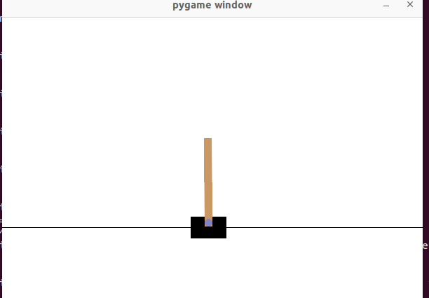

# CartPole REINFORCE with PyTorch

A classic **CartPole (inverted pendulum)** reinforcement learning example, implemented in PyTorch with the classic **REINFORCE (Monte Carlo policy gradient)** algorithm. At every step the agent can take exactly one of two actions:

- **Push the cart to the LEFT** (action = 0)
- **Push the cart to the RIGHT** (action = 1)

## 1. Problem Statement

### Environment

CartPole is one of the most classic benchmark environments in OpenAI Gymnasium (`CartPole-v1`). A cart moves along a horizontal track with a pole hinged on top. The goal is to keep the pole upright for as long as possible by pushing the cart left or right.

### State (Observation)

At every step the agent receives 4 observations:

| Index | Meaning |
| ----- | ------- |
| 0 | Cart position |
| 1 | Cart velocity |
| 2 | Pole angle |
| 3 | Pole angular velocity |

### Actions

The action space is discrete with 2 actions: push LEFT and push RIGHT.

### Rewards and Termination

- The agent receives **+1** for every step the pole stays upright.
- An episode terminates when:
  - the pole tilts more than ±12° (it has fallen);
  - the cart moves outside the track bounds;
  - the step limit is reached (500 steps for `CartPole-v1`).
- Therefore the maximum episode return is **500**, and the training goal is to get the average return as close to 500 as possible.

## 2. Algorithm: REINFORCE (Policy Gradient)

Unlike value-based methods such as DQN, REINFORCE belongs to the **policy gradient** family: instead of learning the value of each action, it **parameterizes the policy directly** with a neural network, `π(a|s)`, which outputs the probability of each action. The network parameters are then updated in the direction that makes good actions more likely and bad actions less likely.

The concrete steps:

1. **Policy network**: takes the 4-dimensional state as input and outputs a probability distribution over the 2 actions (LEFT/RIGHT) via softmax.
2. **Trajectory sampling**: roll out one full episode and collect `(s, a, log π(a|s), r)` for every step.
3. **Discounted returns**: compute `G_t = r_t + γ r_{t+1} + γ² r_{t+2} + ...`, the cumulative return from step `t` until the end of the episode.
4. **Policy gradient update**: the loss is

   ```text
   L = -Σ_t log π(a_t | s_t) * G_t
   ```

   Minimizing `L` is equivalent to updating the policy according to the policy gradient theorem.
5. **Baseline subtraction (variance reduction)**: in practice, the mean return of the episode is used as a baseline, replacing `G_t` with the advantage `A_t = G_t - baseline`. This keeps the gradient direction unbiased while significantly reducing variance and making training more stable.

> REINFORCE is a Monte Carlo method: it must wait for a full episode to finish before updating, so it has high variance and converges slowly. It is the classic entry point for learning about reinforcement learning.

## 3. Directory Structure

```text
cartpole/
├── README.md
├── cartpole_pytorch.py        # REINFORCE + learned value baseline
├── cartpole_actor_critic.py   # one-step TD actor-critic (A2C-style)
├── requirements.txt
└── training_curve.png         # generated by the training scripts
```

## 4. Environment Setup

### Install Python and PyTorch

Python 3.10+ is recommended. First create a virtual environment:

```bash
# Linux / macOS
python3 -m venv venv
source venv/bin/activate

# Windows (PowerShell)
# python -m venv venv
# .\venv\Scripts\Activate.ps1
```

Install PyTorch (the CPU version is enough for this example):

```bash
pip install torch
```

> For GPU support, pick the install command matching your CUDA version at [pytorch.org](https://pytorch.org/get-started/locally/).

### Install Gymnasium and matplotlib

```bash
pip install gymnasium matplotlib
```

`matplotlib` is used for the real-time training plot and is only needed when
you want the live dashboard (the scripts degrade gracefully without it).

### One-shot install

Or install everything from the provided `requirements.txt`:

```bash
pip install -r requirements.txt
```

Contents of `requirements.txt`:

```text
torch>=2.0
gymnasium>=0.29
matplotlib>=3.7
```

## 5. Running

Inside the `cartpole/` directory:

```bash
# Train with a real-time plot (prints evaluation results every 10 episodes)
python cartpole_pytorch.py

# Train without the plot window (the final figure is still saved)
python cartpole_pytorch.py --no-plot

# Train with a rendered animation (more visual, but slower)
python cartpole_pytorch.py --render

# One-step TD actor-critic variant (same options)
python cartpole_actor_critic.py
```

The terminal prints the immediate reward of each episode, the average
evaluation return over 5 greedy episodes, the historical best average, and
the current value loss. When the run is solved, the script prints a
`>>> SOLVED` message and stops early.

## 6. Monitoring Training Progress and Convergence

Both scripts open a live matplotlib window with two panels:

- **Top panel**: `episode reward` (light blue, noisy) and `eval avg`
  (dark blue) per episode. The green dashed line marks the maximum (500) and
  the orange dotted line marks the solved threshold.
- **Bottom panel**: `value loss` of the critic. A steadily decreasing value
  loss means the value network is converging.

The final figure is always saved as `training_curve.png` in the same
directory as the script.

### How to judge whether training is working

| `eval avg` | Meaning |
| ---------- | ------- |
| 9–11 | Random policy: nothing has been learned yet |
| 30–100 | The policy is clearly learning |
| >200 | Good balancing behaviour |
| ≥450 sustained | Solved: the pole is balanced almost every episode |

The single most reliable number is **`eval avg`**: it is measured greedily
over 5 episodes, so it is much less noisy than `episode reward`.

### Convergence criteria used by the scripts

- A run is considered **solved** when `eval avg >= 450` for
  `SOLVED_STREAK` consecutive evaluations (3 evaluations = 30 episodes).
- When that happens the script prints a `>>> SOLVED ...` message and stops
  early by default (`EARLY_STOP = True` at the top of the script). Both
  thresholds can be changed at the top of the file.

### Common pitfalls

- **Do not trust `best avg`**: it only tracks the historical maximum and
  never decreases. It proves the policy was good at least once, not that it
  is good right now.
- **Do not trust a single `episode reward`**: it is one noisy sample. Judge
  by trends over ~50–100 episodes.
- **A flat curve near 9–11 means no learning.** For the one-step TD
  actor-critic this is the expected behaviour on CartPole (see the
  known-limitation note in `cartpole_actor_critic.py`).
- **Convergence means the curve has plateaued near 500**, not that every
  single episode hits 500. Some oscillation around the maximum is normal.

## 7. References

- Sutton & Barto, *Reinforcement Learning: An Introduction* (origin of the REINFORCE algorithm)
- OpenAI Spinning Up – Policy Gradients: <https://spinningup.openai.com/en/latest/spinningup/rl_intro3.html>
- Gymnasium CartPole docs: <https://gymnasium.farama.org/environments/classic_control/cart_pole/>
