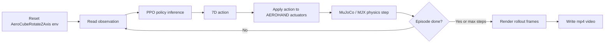

# Rotate Cube Policy Playback

This tutorial shows how to run the pretrained AEROHAND right-hand cube-rotation policy in MuJoCo Playground and export a rollout video.

<video src="video/aero_policy_rollout.mp4" controls width="720"></video>

It assumes you already have MuJoCo installed. This task still needs the reinforcement-learning stack because the policy runs inside the MuJoCo Playground environment `AeroCubeRotateZAxis`, not the basic standalone XML viewer.

## 1. What This Demo Does

The pretrained policy file is:

```text
aero-hand-open/ros2/src/aero_hand_open_rl/aero_hand_open_rl/ppo_TetheriaCubeRotateZAxisTendon_20250926_152920
```

This policy was trained for the AEROHAND cube Z-rotation task. The task environment is implemented here in the upstream repository:

```text
aero-hand-open/sim_rl/mujoco_playground/mujoco_playground/_src/manipulation/aero_hand/rotate_z.py
```

The playback script in this folder:

1. Loads the `AeroCubeRotateZAxis` MuJoCo Playground environment.
2. Rebuilds the same PPO network structure used during training.
3. Loads the pretrained Brax policy params with `brax.io.model.load_params()`.
4. Runs closed-loop policy inference in simulation.
5. Renders the rollout to an mp4 video.

## 2. Clone The AEROHAND Repository

This tutorial package is independent and does not redistribute the full AEROHAND repository or model assets.

Clone the upstream repository:

```bash
cd ~/source
git clone https://github.com/TetherIA/aero-hand-open.git
cd aero-hand-open
git submodule sync
git submodule update --init --recursive
```

The submodule step is important because the MuJoCo Playground code and simulation assets are under `sim_rl/`.

## 3. Environment Setup

Use the same conda environment style as the basic tutorial. Python 3.12 is recommended here.

```bash
conda create -n aerohand-rotate-cube python=3.12 -y
conda activate aerohand-rotate-cube
python -m pip install --upgrade pip
```

Install JAX. For CUDA 12 GPUs:

```bash
pip install -U "jax[cuda12]"
```

For CPU-only testing:

```bash
pip install -U jax
```

Install the local MuJoCo Playground package from the cloned AEROHAND repository:

```bash
cd ~/source/aero-hand-open/sim_rl/mujoco_playground
pip install -e ".[all]" \
  --extra-index-url https://py.mujoco.org \
  --extra-index-url https://pypi.nvidia.com
```

Verify that JAX sees the expected backend:

```bash
python -c "import jax; print(jax.default_backend()); print(jax.devices())"
```

On a GPU machine, the backend should normally be `gpu`.

## 4. Run The Policy

From this tutorial folder:

```bash
cd /path/to/mujoco-sim-basic-aerohand/Tutorial/rotate-cube
conda activate aerohand-rotate-cube
```

Run a short 10-step smoke test first:

```bash
python play_aero_policy_params.py \
  --env_name=AeroCubeRotateZAxis \
  --model_path /path/to/aero-hand-open/ros2/src/aero_hand_open_rl/aero_hand_open_rl/ppo_TetheriaCubeRotateZAxisTendon_20250926_152920 \
  --output test.mp4 \
  --episode_length 10
```

If that works, run the default-length rollout:

```bash
python play_aero_policy_params.py \
  --env_name=AeroCubeRotateZAxis \
  --model_path /path/to/aero-hand-open/ros2/src/aero_hand_open_rl/aero_hand_open_rl/ppo_TetheriaCubeRotateZAxisTendon_20250926_152920 \
  --output aero_policy_rollout.mp4 \
  --episode_length 500
```

For your local machine, the model path is:

```bash
/home/agnes/source/aero-hand-open/ros2/src/aero_hand_open_rl/aero_hand_open_rl/ppo_TetheriaCubeRotateZAxisTendon_20250926_152920
```

## 5. Expected Output

The script writes an mp4 file:

```text
aero_policy_rollout.mp4
```

With `--episode_length 500`, the policy runs for about 25 seconds of simulated time:

```text
500 policy steps * 0.05 s/control step = 25 s
```

The script renders every second policy step, so the output video is about 250 frames at around 10 fps.

## 6. What The Progress Bar Means

If you see a progress bar such as `250/250`, that is the rendering progress, not training progress.

This tutorial does not train a new policy. It only loads an existing policy and runs inference.

## 7. What The Simulation Environment Does

`AeroCubeRotateZAxis` is the task environment used to train and play this policy. It wraps the MuJoCo/MJX physics model into a reinforcement-learning interface:



At a high level, the environment does five things:

1. Loads the MuJoCo scene with the AEROHAND right hand, cube, floor, contacts, tendon actuators, and sensors.
2. Resets the hand and cube state at the start of each episode.
3. Builds the policy observation from simulated tendon/joint sensors and the previous action.
4. Applies the policy's 7-dimensional action to the AEROHAND tendon/joint actuators.
5. Steps MuJoCo/MJX physics, checks termination, and records states for rendering.

The tendon length sensors do not require external hardware in simulation. They are virtual MuJoCo sensors defined in the XML model, such as tendon-position sensors for the fingers and thumb tendons. MuJoCo reads them directly from the simulated model state.

The policy is a PPO neural network trained on these environment observations. During playback, it runs closed-loop inference:

```text
observation -> PPO policy -> 7D action -> MuJoCo actuators -> physics step -> next observation
```

## 8. Simulation vs Real Hardware

The simulation loop and real-hardware deployment have similar control logic, but the source of feedback and the meaning of `step` are different.

In MuJoCo simulation:

1. Status feedback comes from MuJoCo/MJX simulated state and XML-defined sensors.
2. `env.step(action)` writes the action to simulated actuators and advances physics by a fixed time step.
3. The cube state, contacts, tendon lengths, joint position, and hand motion are all computed by the simulator.
4. `step` is a real API concept: one policy action advances the simulated world.

On real hardware:

1. Status feedback comes from the real hand's actuator feedback, such as motor position, speed, current, and temperature.
2. There is usually no separate external tendon-length sensor. The deployment code maps actuator feedback into tendon-like observations for the policy.
3. The policy action is converted into actuator commands and sent to the real motors.
4. The real world advances continuously; there is no MuJoCo-style physics `env.step()`.
5. The closest equivalent of a step is one control-loop tick, for example a ROS timer callback every `0.05s`.

So the correspondence is:

```text
MuJoCo sensor data        <-> real actuator feedback mapped to policy observation
MuJoCo data.ctrl          <-> real actuator command
MuJoCo env.step(action)   <-> real time passing while motors execute the command
MuJoCo policy step        <-> one ROS/control-loop tick
```

This is closed-loop simulation inference. It is not real-time ROS2 deployment and does not communicate with physical hardware.

## 9. Troubleshooting

If 10 steps runs but 500 steps is slow, it is usually rendering or first-run JAX compilation. Try:

```bash
python play_aero_policy_params.py \
  --env_name=AeroCubeRotateZAxis \
  --model_path /path/to/policy \
  --output short.mp4 \
  --episode_length 100
```

If the environment name is not found, make sure you installed the local `sim_rl/mujoco_playground` package from the AEROHAND repository, not only the generic PyPI package.

If JAX reports `cpu` on a GPU machine, reinstall the CUDA JAX wheel and re-check:

```bash
pip install -U "jax[cuda12]"
python -c "import jax; print(jax.default_backend()); print(jax.devices())"
```
