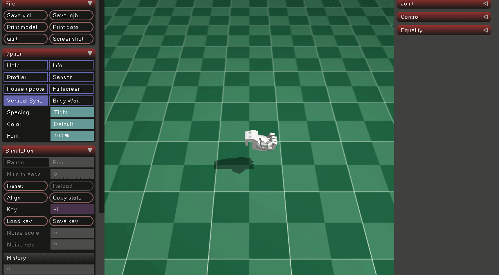
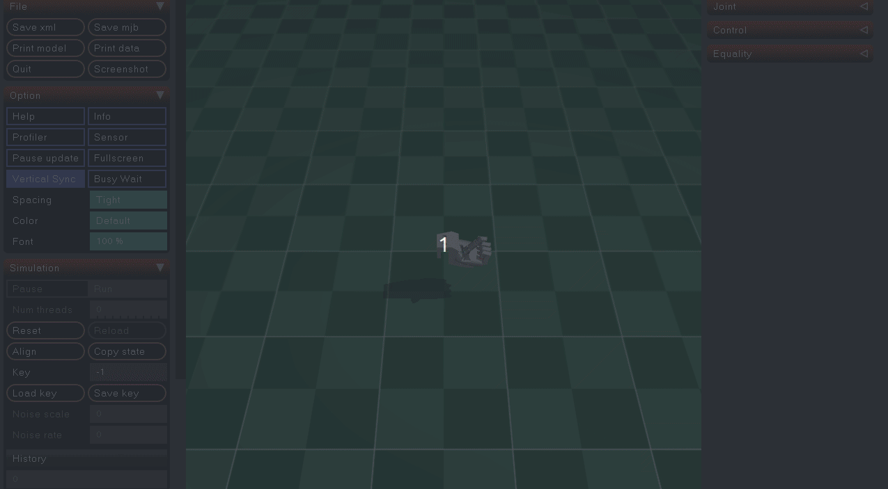

# AEROHAND Sim Basic

This folder is a small learning pack for the MuJoCo simulation of the [AEROHAND](https://github.com/TetherIA/aero-hand-open) right hand.

It includes:

- a viewer script
- a direct actuation demo
- a joint-space demo using the SDK joint-to-actuation mapping
- instructions for downloading the MuJoCo assets needed to run the scene locally

## Recommended MuJoCo Tutorial

Explore more about MuJoCo if you are interested:

[MuJoCo learning tutorial on Bilibili](https://www.bilibili.com/video/BV1y6M767E9x?spm_id_from=333.788.videopod.episodes&vd_source=dcce45eb59124459db0483b594d35621)

## 1. Environment Setup

### 1.0 Download Model Assets

The AEROHAND XML/STL/OBJ model assets are not included in this tutorial package. Download them from the official TetherIA simulation repository at this pinned commit:

[https://github.com/TetherIA/aero-open-sim/tree/dfeff43507fe82f515fed81592070e39a9bb92f6](https://github.com/TetherIA/aero-open-sim/tree/dfeff43507fe82f515fed81592070e39a9bb92f6)

Place the downloaded MuJoCo files into:

```text
Tutorial/assets/
```

The scripts expect at least:

- `Tutorial/assets/scene_right.xml`
- `Tutorial/assets/right_hand.xml`
- the referenced STL/OBJ mesh files in the same `Tutorial/assets/` directory

These model/design assets are covered by TetherIA's design-file license terms. In short, the SDK/software is Apache-2.0, while CAD/STEP/STL/XML-style design/model assets are CC BY-NC-SA 4.0 and are non-commercial unless you have a commercial manufacturing license from TetherIA. Check the upstream repository and `LICENSE.md` for authoritative terms.

### 1.1 Install Miniforge

If you do not already have `conda`, install Miniforge first. It is the recommended conda-forge distribution and gives you a clean base for the rest of this pack.

For Linux x86_64:

```bash
curl -L -O "https://github.com/conda-forge/miniforge/releases/latest/download/Miniforge3-$(uname)-$(uname -m).sh"
bash Miniforge3-$(uname)-$(uname -m).sh
source ~/miniforge3/etc/profile.d/conda.sh
conda config --set auto_activate_base false
```

After installation, open a new shell or run:

```bash
conda init bash
```

If you already have Miniforge installed, you can skip this step.

For Windows:

1. Download the latest `Miniforge3-Windows-x86_64.exe` from the official Miniforge releases page.
2. Run the installer and keep the default options unless you already have a preferred conda setup.
3. Open the installed **Miniforge Prompt** once, then run:

```powershell
conda init powershell
```

If you prefer `cmd.exe`, use:

```cmd
conda init cmd.exe
```

4. Open a new terminal after initialization so `conda` is available.

If you are using WSL on Windows, follow the Linux instructions instead.

### 1.2 Create a Conda Environment

Linux / macOS:

```bash
cd sim-basic
conda create -n aerohand-sim python=3.12 -y
conda activate aerohand-sim
python -m pip install --upgrade pip
```

Windows PowerShell:

```powershell
cd C:\path\to\sim-basic
conda create -n aerohand-sim python=3.12 -y
conda activate aerohand-sim
python -m pip install --upgrade pip
```

Install the runtime dependencies for this learning pack:

```bash
pip install mujoco
```

Install the SDK package so the helper scripts can use the same joint-to-actuation mapping as the real hand:

Linux / macOS:

```bash
pip install aero-open-sdk
```

Windows PowerShell:

```powershell
pip install aero-open-sdk
```

## 2. What Is Here


### `viewer.py`

Opens the right-hand scene and steps the simulation without commanding motion.

### `joint_control_demo.py`
Starts from 16 joint angles in degrees, converts them to 7 actuator values with `JointsToActuationsModel`, then maps them into MuJoCo control values.


### `actuation_sweep_demo.py`
Drives the hand from an open pose toward a closed pose by sending direct actuator commands.

### `sim_aero_hand.py`
Helper class that wraps the MuJoCo model and exposes `set_joint_positions()` and `set_actuations()` in an SDK-like style.

### `mappings.py`
Local conversion utilities between SDK actuator degrees and MuJoCo control values.

## 3. How To Run

From this directory:

Linux / macOS:

```bash
conda activate aerohand-sim
python viewer.py
python joint_control_demo.py
python actuation_sweep_demo.py
```

Windows PowerShell:

```powershell
conda activate aerohand-sim
python viewer.py
python joint_control_demo.py
python actuation_sweep_demo.py
```

## 4. Notes

- The MuJoCo XML expects the mesh files in the local `assets/` folder.
- Model assets are intentionally ignored by git in this tutorial package; download them from the upstream TetherIA repository.
- **These scripts are for simulation only. They do not talk to the real serial hardware**.
